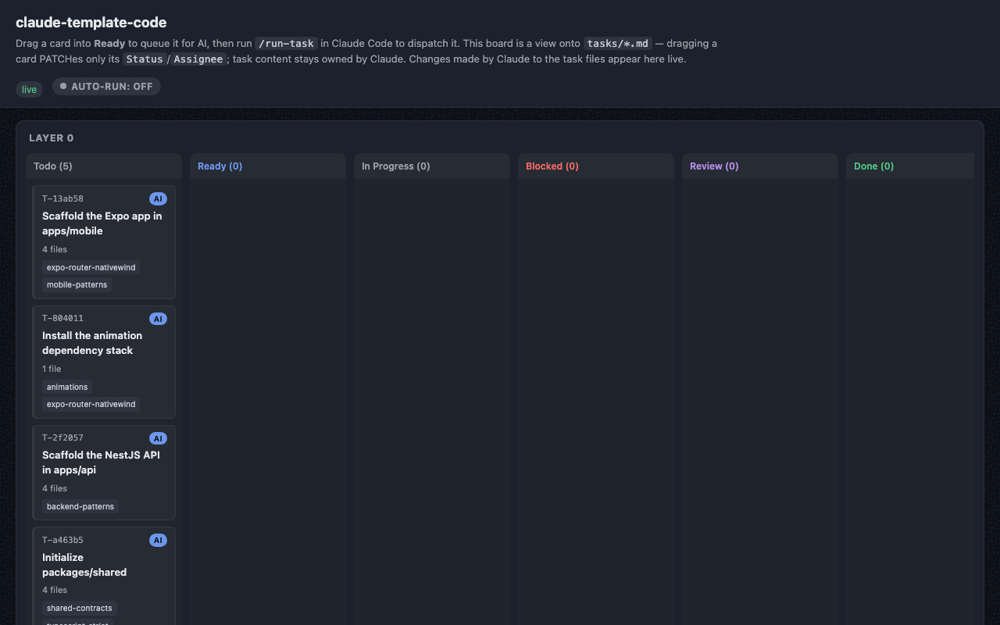

# Claude Code Full‑Stack Template

A native‑first Claude Code starter template for building an **Expo mobile app + NestJS API**
monorepo through a disciplined Brainstorm → Design → Layer → Implement → Test → Checkpoint → Refine
workflow.



<p align="center"><em>The realtime task board (<code>pnpm board</code>) watching a Layer 0 task move Todo → Ready → In&nbsp;Progress → Review → Done.</em></p>

## What this is

This repo is **not** a finished app — it's a template. It ships a complete pnpm + Turborepo
monorepo skeleton, plus a full Claude Code "native engine" (skills, subagents, slash commands,
hooks, `settings.json`) that drives you through building your own product from a one‑line idea to
a tested, CI‑gated codebase.

It is **native‑first**: instead of simulating the workflow with plain markdown instructions, it
uses Claude Code's own primitives — skills, subagents, slash commands, hooks, `settings.json`, and
Plan Mode — as the actual workflow engine.

It is also **token‑disciplined by design**: `CLAUDE.md` keeps the always‑loaded context to about
a hundred lines (everything else is read on demand), skills are consolidated per domain with
progressive‑disclosure `references/` (only the file matching the task is read), one reviewer pass
covers correctness + simplification + security, and small layers skip the subagent fan‑out
entirely.

`apps/mobile`, `apps/api`, and `packages/shared` ship **empty** (only a `.gitkeep` each). They are
scaffolded for real during your project's own **Layer 0**, once your design spec is approved — this
template only provides the monorepo configuration around them.

The template is tuned for a product that wants **smooth UI and beautiful animations** with React
Native Reanimated v4 — the mobile foundation and an authored animation skill bake in the Reanimated
4 essentials and gotchas from day one.

**HARD GATE:** no code, no scaffolding, no `apps/*` changes before a design spec has been written to
`docs/specs/` and approved by you. A fresh clone has an empty `docs/specs/`, which is exactly what
triggers Phase 0 automatically the moment you open the repo in Claude Code.

## Features

Everything in the box, at a glance. Each item is detailed in the linked doc or the sections below.

**Disciplined workflow engine**
- **Phase 0 brainstorming** (🔒 HARD GATE) — no code before an approved design lands in `docs/specs/`.
- **Constitution** (`docs/CONSTITUTION.md`) — versioned, first‑class governing principles; the repo's highest authority, cited by specs/plans/reviews. A 10‑bullet digest lives in `CLAUDE.md`; the full text is read on demand.
- **Dependency‑layered delivery** — work ships in ordered layers (`tasks/layer-*.md`); no layer advances until its tests pass.
- **Built‑in consistency self‑check** — `scope-planner` cross‑checks spec ↔ scope ↔ tasks + constitution compliance before returning each layer file.
- **Checkpoints + learning in one pass** (`/checkpoint`) — regenerates `CHECKPOINT.md` **and** extracts durable gotchas into `.learnings/` (with a structured `error-memory.md` the `debugger` consults/records).
- **Rollback playbook** — `layer-N-done` checkpoint tags + safe task/layer revert procedures.

**Native Claude Code engine, sized for token efficiency**
- **14 skills** (11 authored + 3 vendored), **5 subagents**, **11 slash commands**, **hooks** (block heavy builds, auto‑format, commit reminder, runner no‑egress), committed `settings.json`.
- Domain skills (`mobile-patterns`, `backend-patterns`, `security`, `animations`) use a short routing `SKILL.md` + on‑demand `references/` — an agent reads only the pattern file its task touches.
- Worktree‑isolated parallel `task-implementer`s (3+ tasks; small layers run sequentially on the main thread) → a single `reviewer` pass (correctness + simplification + security lens, escalated to Opus for auth/payment layers) → `test-writer` only when a layer has cross‑task flows; plus a `debugger` subagent.

**Full‑stack monorepo** — pnpm workspaces + Turborepo, TypeScript strict throughout.
- **Mobile** — Expo + Expo Router + NativeWind + **Reanimated 4** (New Architecture) + Gesture Handler + Skia + FlashList + `expo-image`.
- **Backend** — **NestJS** (Fastify adapter) + **Prisma** + `nestjs-zod`.
- **Shared** — `packages/shared` zod contracts as the single source of truth for both apps.

**Beautiful animations** — the `animations` skill: a taste layer (when to animate, Reduce‑Motion aware) gating a Reanimated v4 recipe library (scroll‑driven 3D cards, swipe‑to‑island morph, gestures, carousel, Skia effects).

**Security** — one `security` skill (review method, STRIDE threat modeling, ASVS backend hardening, MASVS mobile hardening as on‑demand references); `/security-review` & `/threat-model` commands; the security lens built into every `reviewer` pass; `docs/SECURITY.md` (OWASP **ASVS**/**MASVS** + tool matrix); CI `security.yml` (Gitleaks + Semgrep + `pnpm audit`) + Dependabot.

**Realtime task board** (`tools/board/`, `pnpm board`) — a kanban over `tasks/*.md`, live over WebSocket, two‑way (drag a card into **Ready** → `/run-task` drains it), multi‑project (auto free‑port + project name). **Optional autonomous runner** (`pnpm board:auto`, **off by default**) — a dragged card is implemented by a headless `claude` run in an isolated worktree → **review** (never auto‑push/merge), with an on/off toggle + an enforced no‑egress hook + per‑task timeout.

**CI/CD & DevOps** — 5 GitHub Actions (quality gate · security · EAS preview/production · API deploy) + Dependabot; `docs/deploy/` provider playbooks (Railway/Render/Fly/Docker‑VPS/generic) + `environments.md`; EAS pipeline for the mobile app.

**One‑command bootstrap** — `scripts/start-project.*` seeds a new project (name + brief/spec) and hands off to Phase 0.

## Requirements

- [Claude Code](https://docs.claude.com/claude-code) — CLI, desktop app, web (claude.ai/code), or IDE extension. This is the engine that runs the template's workflow (skills, subagents, slash commands, hooks); it's a build/assist dependency, not a runtime one — the Expo app and NestJS API you produce run without it.
- Node.js ≥ 20
- pnpm (`npm install -g pnpm@9` if you don't have it)
- git
- For mobile development: Watchman, Xcode (iOS) and/or Android Studio (Android)

## Quick start

Three parts: **(1)** bootstrap the project in a terminal, **(2)** open it in Claude Code — pick
your surface, **(3)** drive the build. Steps 1 and 3 are identical everywhere; only *how you open
the project* (step 2) differs between the CLI, the desktop app, and an IDE extension.

### 1. Bootstrap the project (terminal, once)

```bash
git clone <this-template-url> my-app
cd my-app
./scripts/start-project.sh          # Windows: scripts\start-project.ps1  (or .bat)
```

The script asks for a project name and either an existing spec/brain‑dump file **or** a short
description, then writes `docs/BRIEF.md` (and `docs/SPECIFICATIONS.md` if you gave it a file) and
makes sure `docs/specs/` is empty — that emptiness is exactly what triggers Phase 0 later.

> You only run this once, in a terminal, no matter which Claude Code surface you use next.

### 2. Open the project in Claude Code

Do **one** of the following. In every case, opening the folder makes Claude read `CLAUDE.md`, whose
hard gate sees the empty `docs/specs/` and starts **Phase 0** automatically. If it doesn't kick off
on its own, just type `/phase-0`.

**A — Terminal (CLI)**

```bash
cd my-app
claude                              # starts a session in this folder
```

Claude reads `CLAUDE.md` on start → Phase 0 begins in the terminal.

**B — Desktop app (macOS / Windows)**

1. Open the Claude Code desktop app.
2. **Open / add** the `my-app` folder as the project (so the app's working directory *is* the repo root).
3. Start a new session in that folder → `CLAUDE.md` loads → Phase 0 begins.

**C — IDE extension (VS Code / JetBrains)**

1. Install the **Claude Code** extension (VS Code Marketplace or JetBrains Plugins).
2. Open the `my-app` folder in the IDE.
3. Open the Claude Code panel and start a session → `CLAUDE.md` loads → Phase 0 begins.

### 3. Drive the build (same on every surface)

1. **Phase 0 (design).** Claude brainstorms your idea **one question at a time**, proposes a few
   approaches, and writes an approved design to `docs/specs/`. 🔒 **HARD GATE** — nothing is coded
   or scaffolded until you approve.
2. **`/scope-breakdown`** — turns the approved design into `tasks/layer-0-todo.md` (the foundation
   layer), self-checked for coverage/consistency/constitution compliance before it's handed back.
3. **`/run-layer`** — implements the current layer (worktree‑isolated `task-implementer`s for 3+
   tasks, sequential main-thread for small layers), then one `reviewer` pass.
4. **`/next-layer`** — once the layer's tests pass, advances to the next layer. Repeat 3–4 until done.
5. **Between layers:** `/checkpoint` (checkpoint + learnings in one pass).
6. **Later bugs/features:** `/refine` (brainstorm → `tasks/layer-refinement-todo.md`).

### 4. (Optional) Watch progress on the task board

In a **separate** terminal, from the repo root:

```bash
pnpm board                          # → http://127.0.0.1:<port>  (prints the project name + URL)
```

A realtime kanban over `tasks/*.md`. Drag a card into **Ready** to queue it for the AI, then run
`/run-task` in your Claude Code session to have it picked up. Running several projects at once is
fine — each board auto‑picks a free port and shows its project name (see `tools/board/README.md`).

## Repo structure

```
claude_template_code/
├── CLAUDE.md                     # Source of truth; ~100 lines, nothing auto-imported
├── README.md                     # Human-facing intro + how to start
│
├── .claude/
│   ├── settings.json             # hooks + permissions + env (committed)
│   ├── settings.local.json.example
│   ├── skills/                   # 11 authored + 3 vendored (domain skills: SKILL.md + references/)
│   ├── agents/                   # subagent definitions
│   ├── commands/                 # slash commands
│   └── hooks/                    # hook scripts referenced by settings.json
│
├── docs/
│   ├── BRIEF.md  PRD.md  ARCHITECTURE.md  SCOPE_BREAKDOWN.md
│   ├── WORKFLOW.md  CI_CD.md  CONTINUOUS_LEARNING.md
│   ├── SECURITY.md               # ASVS/MASVS standards, tool matrix, workflow
│   ├── EXTERNAL_SKILLS.md        # provenance/version/license of vendored skills
│   ├── deploy/                   # NestJS API deploy playbooks (README, environments, per-provider)
│   ├── specs/                    # design docs land here (empty until Phase 0 runs)
│   └── phases/phase-0.md
│
├── tasks/
│   ├── layer-0-todo.md  layer-refinement-todo.md  done.md
│
├── .learnings/
│   ├── .gitkeep
│   └── error-memory.md           # structured failure log — debugger consults/records it
│
├── apps/
│   ├── mobile/.gitkeep           # Expo app — scaffolded in Layer 0
│   └── api/.gitkeep              # Node backend — scaffolded in Layer 0
├── packages/
│   └── shared/.gitkeep           # shared zod schemas + types + config
│
├── .github/workflows/
│   ├── ci.yml  security.yml  eas-preview.yml  eas-production.yml  api-deploy.yml
│
├── tools/
│   └── board/                     # realtime task-board dashboard (`pnpm board`)
│
├── scripts/
│   ├── start-project.sh / .ps1 / .bat   checkpoint.js
│
├── CHECKPOINT.md                 # generated after each layer
├── package.json  pnpm-workspace.yaml  turbo.json  tsconfig.base.json
├── .env.example  .gitignore  eas.json
```

## Workflow summary

```
Fresh clone (no design in docs/specs/)
  → PHASE 0 (Plan Mode, HARD GATE): /phase-0 → brainstorming skill → design doc → user approve
  → SCOPE BREAKDOWN: /scope-breakdown → scope-planner → tasks/layer-*.md + built-in self-check
       (Layer 0 = scaffold Expo + API + shared + base config + CI)
  → LAYER LOOP (per layer):
       /run-layer → ≤2 tasks: sequential main thread | 3+: task-implementer fan-out → merge
                  → reviewer (correctness + simplification + security, one pass)
       /next-layer  [gate: all tests pass; test-writer only for cross-task flows]
  → BETWEEN LAYERS: /checkpoint → CHECKPOINT.md + .learnings/ (+ compact context)
  → REFINEMENT: user reports bug/feature → /refine → brainstorm → layer-refinement-todo.md → implement
```

Three discipline gates hold this together: (1) no code before the spec is approved; (2) no
advancing to the next layer before its tests pass; (3) no hard‑coded secrets — use `.env` /
`packages/shared/config` only. See `docs/WORKFLOW.md` for the full guide.

## Slash commands

| Command | What it does |
|---|---|
| `/phase-0` | Enter Plan Mode, run the `brainstorming` skill, write the approved design to `docs/specs/` (HARD GATE — no code first) |
| `/scope-breakdown` | Dispatch the `scope-planner` subagent against the approved spec → create + self-check `tasks/layer-*.md` |
| `/pick-task` | Show the next task in the current layer and load its relevant skills |
| `/run-layer` | Implement the current layer — fan out 3+ independent tasks to worktree‑isolated `task-implementer`s (sequential for ≤2), merge, then run the `reviewer` |
| `/next-layer` | Verify the layer's tests pass, advance `tasks/done.md`, create the next layer, bump "Current Layer" in `CLAUDE.md` |
| `/checkpoint` | Generate `CHECKPOINT.md` + extract layer learnings into `.learnings/`, then compact context |
| `/refine` | Brainstorm a reported bug/feature, then append it to `tasks/layer-refinement-todo.md` |
| `/security-review` | Run the `security` skill over a diff/PR/path → high-confidence security findings |
| `/threat-model` | STRIDE threat model on a named feature before implementation |
| `/board` | How to launch the realtime task-board dashboard (`pnpm board`, runs outside this session) |
| `/run-task` | Drain every `Status: ready` task across `tasks/*.md` via worktree‑isolated `task-implementer`s |

## Task dashboard

`tools/board/` is a small, dependency-light realtime kanban view over
`tasks/*.md` — a PM-facing dashboard, not part of the Claude Code engine.
Run it with:

```bash
pnpm board
```

then open the URL it prints (it auto-picks a free port). It renders the six
`Status` columns (Todo → Ready → In Progress → Blocked → Review → Done) as
swimlanes grouped by layer, updating live over WebSocket whenever
`tasks/*.md` changes on disk. Dragging a card into **Ready** is the "assign
to AI" action — it PATCHes that task's `Status`, and `/run-task` picks up
whatever's sitting in Ready next. The board only ever writes
`Status`/`Assignee`; task content stays owned by Claude. It's a plain Node
process — start it in its own terminal, not inside a Claude Code session
(see `/board` and `tools/board/README.md`).

## Skills

Skills are consolidated per domain. The four big ones are **routing skills**:
a short `SKILL.md` (core rules + a table of contents) plus `references/`
files that are read only when a task actually touches that area — so loading
a skill costs ~30 lines, not the whole domain.

### Authored

| Skill | Purpose |
|---|---|
| `brainstorming` | Phase 0 loop: clarify → 2‑3 approaches → design doc |
| `mobile-patterns` | All mobile feature patterns — screens/navigation, auth + secure storage, TanStack Query API integration, forms + lists, i18n/theme (5 on-demand references) |
| `expo-router-nativewind` | Mobile foundation: root layout, NativeWind, Reanimated setup, New Arch |
| `animations` | Taste layer (when/why to animate, Reduce Motion) + Reanimated v4 recipe library (2 references, principles first) |
| `mobile-testing-release` | Jest + RTL unit tests, Maestro e2e flows, release checklist |
| `expo-eas-pipeline` | EAS build/submit/update profiles, channels, secrets |
| `backend-patterns` | All backend patterns — NestJS modules/DI/guards, Prisma, REST design, Jest+Supertest testing (4 on-demand references) |
| `security` | One security skill — diff review method, STRIDE threat modeling, ASVS backend hardening, MASVS mobile hardening (4 on-demand references) |
| `shared-contracts` | `packages/shared` zod schemas as the mobile↔api single source of truth |
| `typescript-strict` | No `any`, narrowing, discriminated unions, `satisfies` |
| `git-workflow` | Conventional commits, branch naming, 1 commit = 1 task |

### Vendored (external, license‑preserved)

| Skill | Source | Why |
|---|---|---|
| `react-native-best-practices` | software‑mansion‑labs/skills | Authoritative Reanimated 4, gestures, Skia, 120fps |
| `react-native-guidelines` | vercel‑labs/agent‑skills | Perf guardrails: FlashList, memoization, expo‑image |
| `ponytail` | DietrichGebert/ponytail | Code‑minimalism discipline (anti over‑engineering) |

See `docs/EXTERNAL_SKILLS.md` for pinned commits, licenses, and re‑sync commands.

## Animation

Reanimated v4 requires the **New Architecture** (`newArchEnabled: true` in `app.json`), and worklets
now live in a separate `react-native-worklets` package. The `expo-router-nativewind` foundation
skill wires this up; the `animations` skill holds both the taste layer (*whether and how much* to
animate — honoring `useReducedMotion()`, 200–350ms durations, springs, UI‑thread‑only work) and the
recipe library (scroll‑driven 3D cards, swipe‑to‑island morph, gesture interactions, carousels,
Skia effects) — principles are applied before any recipe is implemented.

## CI/CD

Five GitHub Actions workflows live in `.github/workflows/`:

- `ci.yml` — on every PR/push: `pnpm turbo run lint typecheck test`
- `security.yml` — on every PR/push: Gitleaks (secrets), Semgrep (SAST), `pnpm audit` (dependencies)
- `eas-preview.yml` — builds an EAS preview profile from `develop` / manual dispatch
- `eas-production.yml` — manual, gated EAS production build (+ optional submit)
- `api-deploy.yml` — builds the API Docker image; the actual hosting deploy step is left as a
  provider‑agnostic placeholder for you to fill in

`.github/dependabot.yml` runs alongside these: weekly `npm` updates across the workspace and
`github-actions` updates for the workflows themselves.

See `docs/CI_CD.md` for required secrets and gate rules.

## License

MIT
